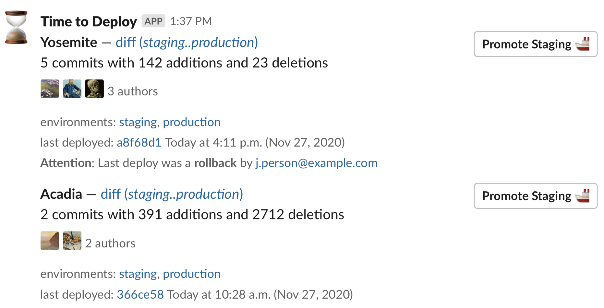

# time to deploy

> Slack bot for reminding about Heroku deployments




## Why

Using a `/remind` works in Slack but info is lacking. The Heroku dashboard
also doesn't show a diff between prod and staging when there was a rollback.

This Slack bot provides info about Heroku deployments including:

- diff between staging and production
- current commit on production
- when code was last deployed to production
- info on whether the last deploy was a rollback
- promotion button from staging to prod
- links to staging and production envs

## Setup Up

### Slack

1. Navigate to <https://api.slack.com/apps>

2. Hit "Create New App" giving the app a name and selecting the workspace

3. Under "Add features and functionality" select "Permissions"

4. Add `chat:write:bot` as a permission

5. At the top of the page, still under "OAuth & Permissions" select "Install App to Workspace"

6. Copy the "OAuth Access Token" and save it for later. We'll need for deploying the app. (`TTD_SLACK_API_TOKEN`)

7. Navigate back to the "Basic Information" tab under "Settings" and
   configure the color, image, and description for the bot under "Display
   Information". Don't forget to hit "Save"!

### GitHub

1. Navigate to <https://github.com/settings/apps>

2. Hit "New GitHub App" and provide a name and home page url (can be anything, like <https://github.com/sbdchd/time-to-deploy>)

3. Scroll to the "Webhook" section and uncheck "Active"

4. Scroll to "Repository permissions" and select "read-only" for "Contents"

5. Scroll to bottom and click "Create GitHub App"

6. Record your "App ID" (`TTD_GITHUB_APP_ID`) shown under the "About" section

7. Scroll to "Private keys" and click, "Generate a private key"

8. Convert the downloaded private key to base64. For example, `base64 my-app-name.2020-01-01.private-key.pem`. Use this encoded value for `TTD_GITHUB_APP_PRIVATE_KEY_BASE_64`.

9. On the left hand side click "Install App". Install the app.

10. Note the ID in your URL. For example, from the URL `https://github.com/settings/installations/15330603`, the installation ID would be "15330603" (`TTD_GITHUB_INSTALL_ID`).

### Deployment

1. Log into the AWS console and navigate to <https://console.aws.amazon.com/lambda/#/functions>

2. Press the "Create function" button in the upper right hand corner.

3. Leave the "Author from scratch" section selected & fill out the function
   name with `time-to-deploy`. The default nodejs version is fine. Press "Create Function"

4. In the "Designer" panel press the "+ Add trigger" button and select "CloudWatch Events".

5. create a new rule giving it a name, this is going to be the cron that runs the deploy reminder.

6. in the schedule expression input `cron(30 14 ? * MON-FRI *)` which will run the job
   every weekday at 14:00 UTC. see
   <https://docs.aws.amazon.com/AmazonCloudWatch/latest/events/ScheduledEvents.html>
   for more info on the cron format. Hit the add trigger button.

7. Back at the function detail page scroll down to the env and input the env
   vars according to the `.env-example` file located in this repo. Use the
   previous OAuth Acess Token that starts with `xoxp-` as the
   `TTD_SLACK_API_TOKEN`. For the `TTD_SLACK_CHANNEL_ID` you'll want to get the
   channel ID from the Slack URL. Don't forget to save your changes.

8. Now we need to update our function with the actual code. Run `s/build` and
   `s/deploy`. If you didn't name your lambda function `time-to-deploy`, be
   sure to update the `s/deploy` script before running it.

### Test the Function

Run the function and ensure the deploy message appears in your Slack channel.

```shell
s/run
```

## Dev

```shell
yarn install

s/lint
s/test

s/build

s/deploy

# run the lambda, usually for testing
s/run
```
